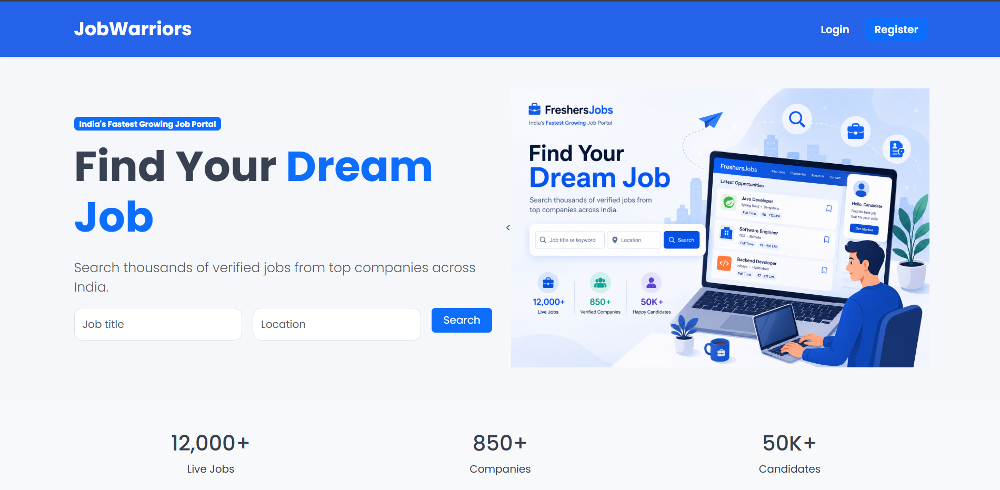
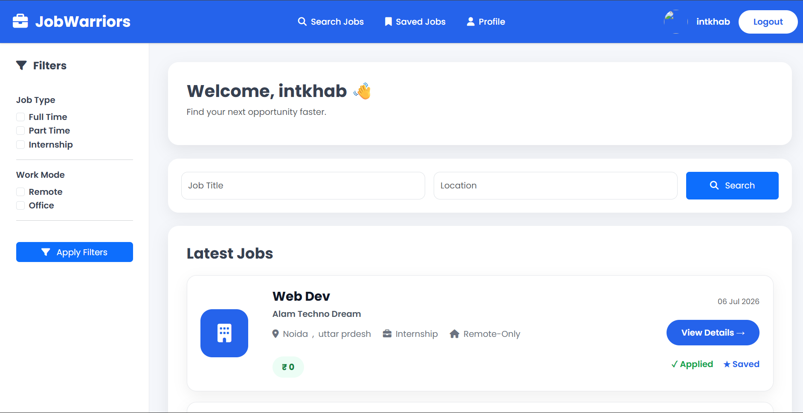
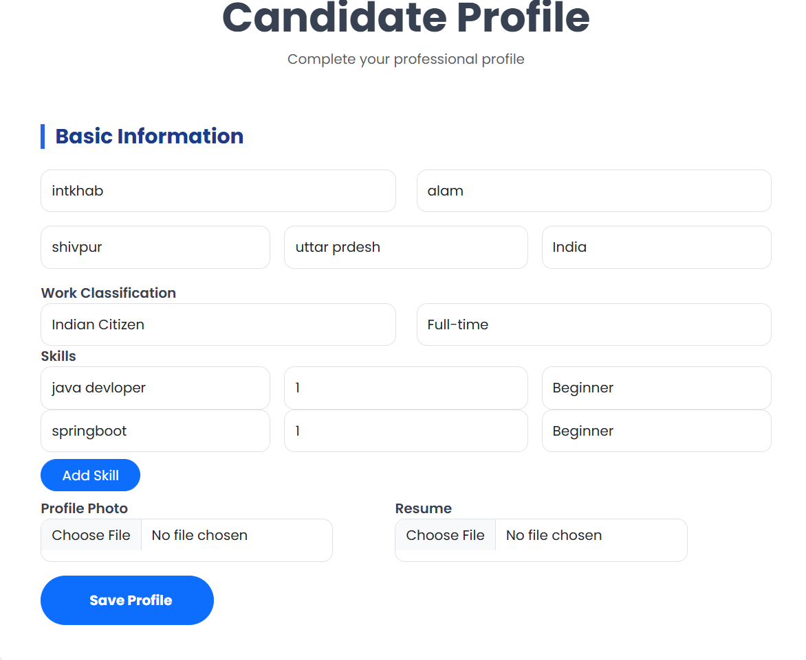
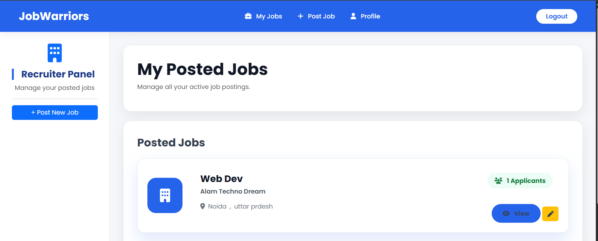
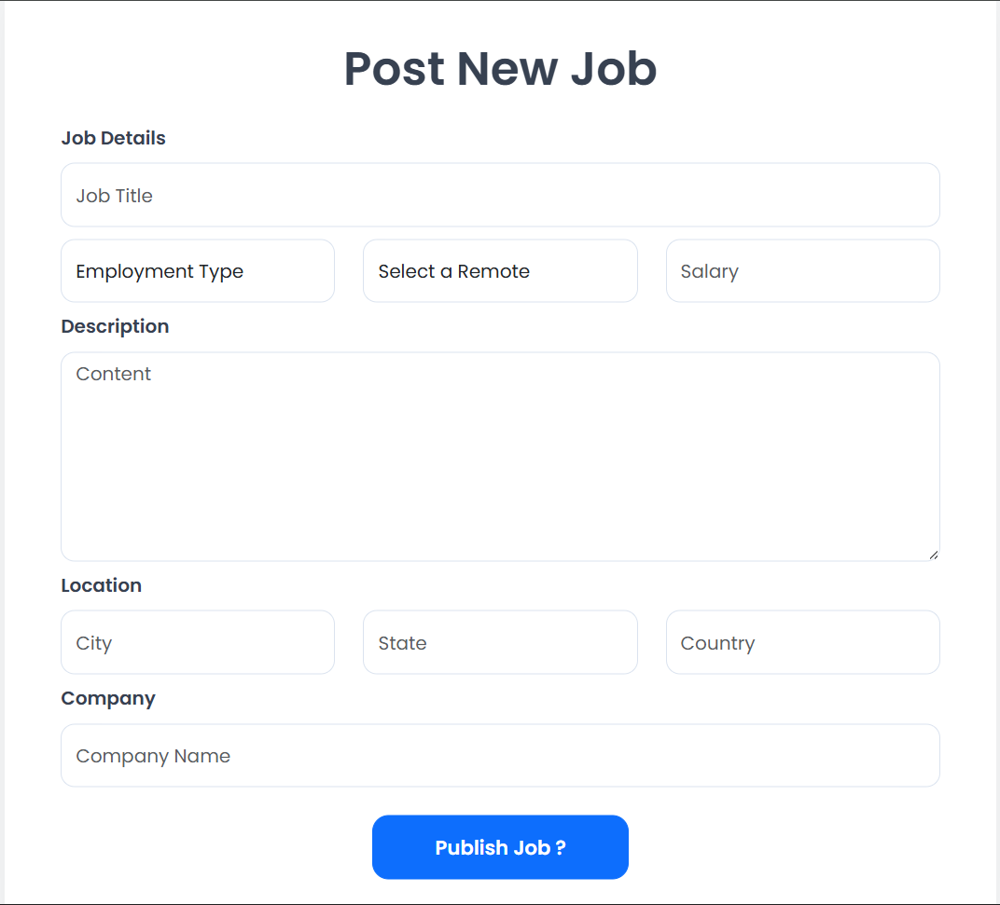
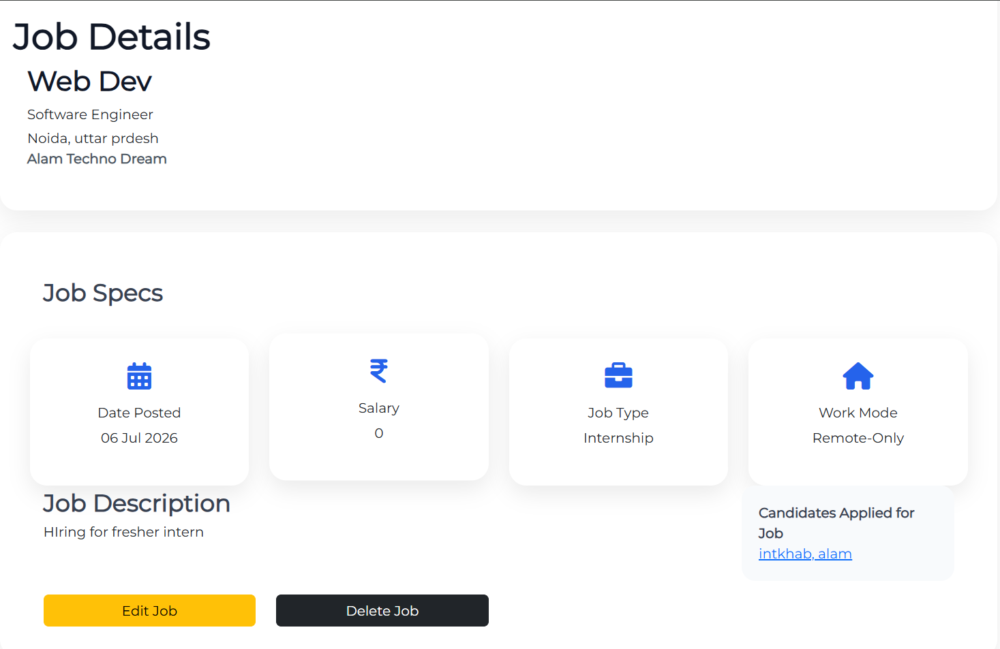

# 💼 JobWarriors

<div align="center">

## Modern Job Portal Platform

A Full-Stack Job Portal built using **Java**, **Spring Boot**, **Spring Security**, **Thymeleaf**, and **MySQL**.


</div>

---

# 📖 About

JobWarriors is a full-stack recruitment platform developed using Spring Boot, Spring Security, Thymeleaf, and MySQL.

The platform allows recruiters to publish and manage job postings while enabling job seekers to search jobs, upload resumes, and apply securely.

---

# ✨ Features

## 👨‍🎓 Job Seeker

- Register & Login
- Search Jobs
- Apply for Jobs
- Save Jobs
- Upload Resume
- Profile Management
- Job Filters

## 👨‍💼 Recruiter

- Recruiter Dashboard
- Post New Jobs
- Update Jobs
- Delete Jobs
- View Applicants

## 🔐 Security

- Spring Security
- Role Based Authentication
- BCrypt Password Encryption

## 🌐 Backend

- REST APIs
- Spring MVC
- Hibernate
- Spring Data JPA
- MySQL

---

# 🛠 Tech Stack

| Category | Technologies |
|-----------|--------------|
| Language | Java |
| Backend | Spring Boot, Spring MVC |
| Security | Spring Security |
| ORM | Hibernate, Spring Data JPA |
| Database | MySQL |
| Frontend | Thymeleaf, HTML, CSS, Bootstrap, JavaScript |
| Build Tool | Maven |
| Tools | IntelliJ IDEA, Git, GitHub, Postman |

---

# 🏗 Architecture

```text
Browser
    │
Spring Security
    │
Controllers
    │
Services
    │
Repositories
    │
MySQL Database
```

---

# 📸 Application Preview

## 🏠 Home Page



---

## 🔐 Login


---

## 📝 Registration


---

## 👨‍🎓 Candidate Dashboard



---

## 👤 Candidate Profile



---

## 👨‍💼 Recruiter Dashboard



---

## ➕ Post New Job



---

## 📄 Job Details



---

# ⚙ Installation

Clone Repository

```bash
git clone https://github.com/alamintkhab1716-hash/JobWarriors.git
```

Move into Project

```bash
cd JobWarriors
```

Configure Database

```properties
spring.datasource.url=jdbc:mysql://localhost:3306/jobwarriors
spring.datasource.username=*****
spring.datasource.password=******
```

Run

```bash
mvn spring-boot:run
```

Open

```
http://localhost:8080
```

---

# 📡 REST API

| Method | Description |
|---------|-------------|
| GET | Fetch Jobs |
| POST | Create Job |
| PUT | Update Job |
| DELETE | Delete Job |

---

# 🚀 Future Enhancements

- Email Notifications
- Docker Support
- CI/CD Pipeline
- Cloud Deployment
- Admin Dashboard

---

# 👨‍💻 Author

**Intkhab Alam**

Backend Developer | Java | Spring Boot | MySQL

GitHub:
https://github.com/alamintkhab1716-hash

LinkedIn:
(Add your LinkedIn profile)

---

## ⭐ Support

If you like this project, don't forget to ⭐ Star this repository.
