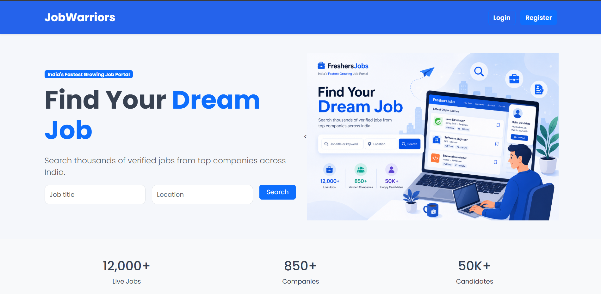
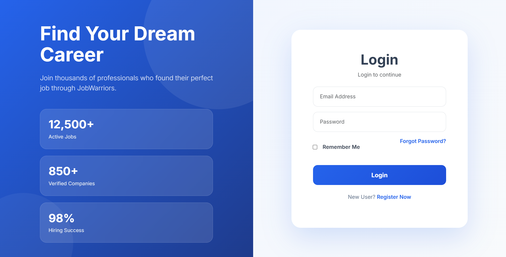
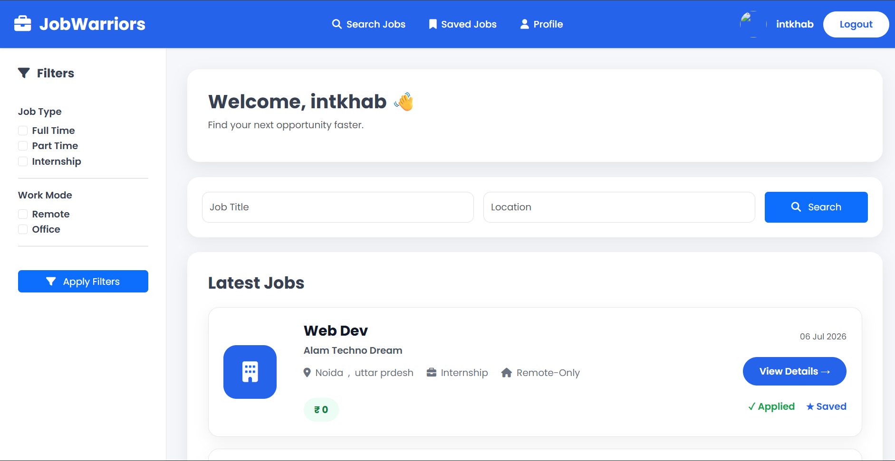
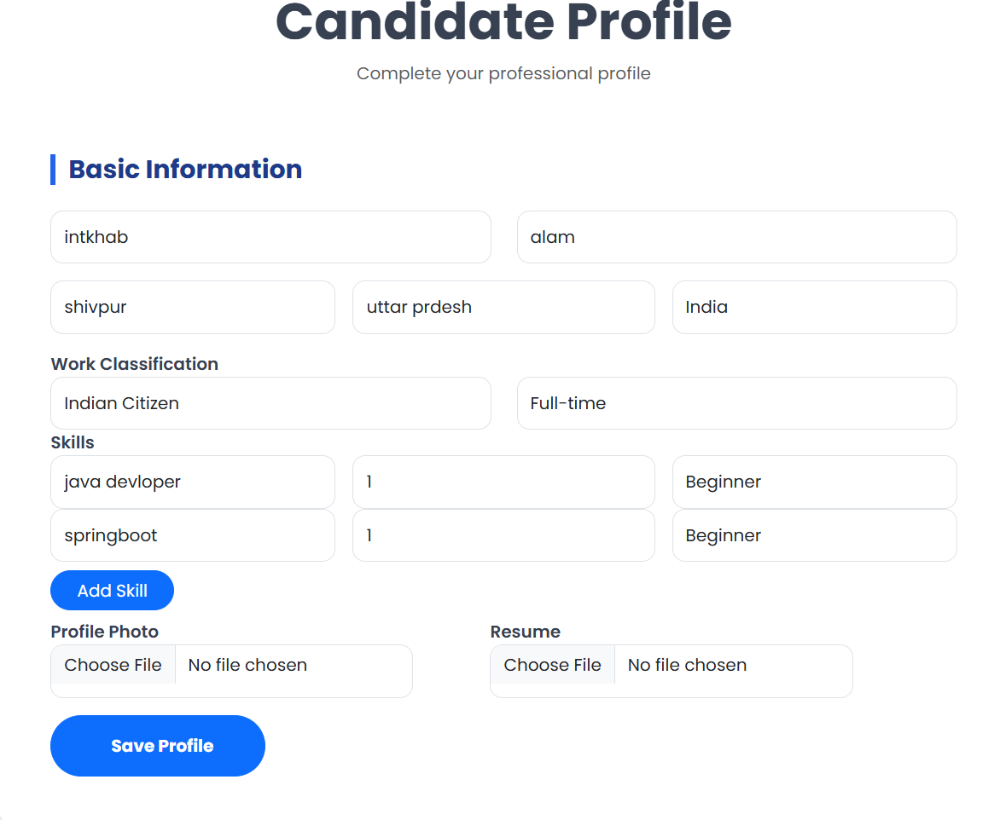
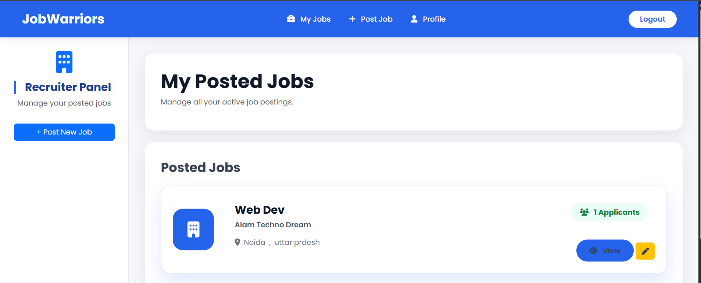
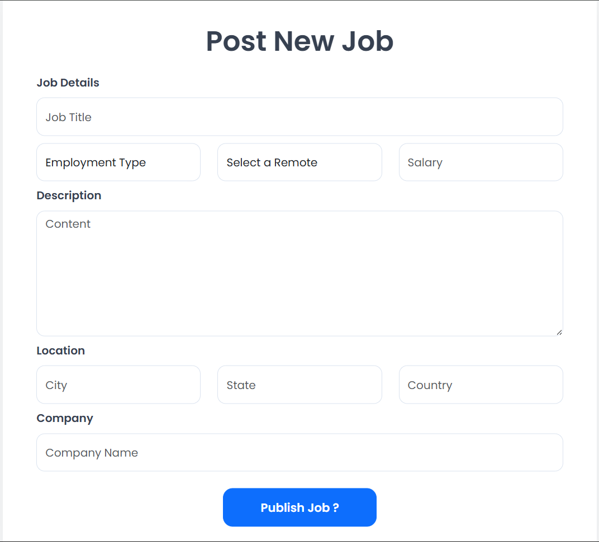
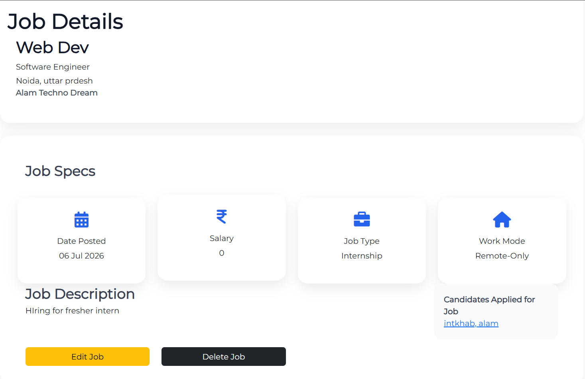

# 💼 JobWarriors

<div align="center">

## 🚀 Full-Stack Job Portal

A job recruitment platform built with **Java, Spring Boot, Spring Security, Thymeleaf, Hibernate, Spring Data JPA, and MySQL**.


</div>

---

## 📖 About the Project

**JobWarriors** is a full-stack job portal application designed to connect **job seekers and recruiters** through a secure recruitment platform.

Job seekers can search for jobs, view job details, apply for suitable positions, upload resumes, save jobs, and manage their profiles.

Recruiters can create and manage job postings and view applicants through a dedicated recruiter dashboard.

The application uses **Spring Security** for authentication and authorization, **Spring Data JPA and Hibernate** for database interaction, and **MySQL** for data storage.

---

## ✨ Features

### 👨‍🎓 Job Seeker

* User Registration and Login
* Search Jobs
* Filter Jobs
* View Job Details
* Apply for Jobs
* Save Jobs
* Upload Resume
* Manage Profile

### 👨‍💼 Recruiter

* Recruiter Registration and Login
* Recruiter Dashboard
* Create Job Posts
* Update Job Posts
* Delete Job Posts
* View Applicants
* Manage Posted Jobs

### 🔐 Security

* Spring Security Authentication
* Role-Based Authorization
* BCrypt Password Hashing
* Secure User Sessions

### 🌐 Backend

* REST APIs
* Spring MVC
* Layered Architecture
* Spring Data JPA
* Hibernate ORM
* MySQL Database


## 🎥 Project Demo

🔊 **Watch the complete JobWarriors project walkthrough on LinkedIn.**

The video covers the project architecture, technology stack, authentication and authorization, database interaction, and request flow.

👉 **[Watch Project Demo on LinkedIn](https://lnkd.in/p/gmuU-pqF)**


---

## 🛠️ Technology Stack

| Category             | Technology            |
| -------------------- | --------------------- |
| Programming Language | Java                  |
| Backend Framework    | Spring Boot           |
| Web Framework        | Spring MVC            |
| Security             | Spring Security       |
| ORM                  | Hibernate             |
| Persistence          | Spring Data JPA       |
| Database             | MySQL                 |
| Frontend             | HTML, CSS, JavaScript |
| UI Framework         | Bootstrap             |
| Template Engine      | Thymeleaf             |
| Build Tool           | Maven                 |
| API Testing          | Postman               |
| Version Control      | Git & GitHub          |
| IDE                  | IntelliJ IDEA         |

---

## 🏗️ Application Architecture

JobWarriors follows a layered architecture:

```text
                    Browser
                       │
                       ▼
              Spring Security
                       │
                       ▼
                  Controller
                       │
                       ▼
                 Service Layer
                       │
                       ▼
              Repository Layer
                       │
                       ▼
               MySQL Database
```

### Request Flow

```text
User
 │
 ▼
Browser
 │
 ▼
Spring Security
 │
 ▼
Controller
 │
 ▼
Service
 │
 ▼
Repository
 │
 ▼
MySQL
 │
 ▼
Repository
 │
 ▼
Service
 │
 ▼
Controller
 │
 ▼
Thymeleaf
 │
 ▼
HTML Response
 │
 ▼
Browser
```

---

## 🌿 Why Thymeleaf?

Thymeleaf is a **Java server-side template engine** that integrates with Spring Boot.

The Controller sends data to the Thymeleaf template, and Thymeleaf uses that data to render the final HTML page.

```text
Spring Boot Controller
          │
          ▼
       Model Data
          │
          ▼
       Thymeleaf
          │
          ▼
      HTML Page
          │
          ▼
       Browser
```

---

## 🔐 Authentication & Authorization

The application uses **Spring Security** to secure user accounts.

### Authentication

Authentication verifies the identity of the user.

```text
Email + Password
       │
       ▼
Spring Security
       │
       ▼
Credential Verification
       │
       ▼
Authenticated User
```

### Authorization

Authorization determines what an authenticated user is allowed to access.

For example:

```text
JOB SEEKER
 ├── Search Jobs
 ├── Apply for Jobs
 ├── Save Jobs
 ├── Upload Resume
 └── Manage Profile

RECRUITER
 ├── Create Jobs
 ├── Update Jobs
 ├── Delete Jobs
 └── View Applicants
```

---

## 🗄️ Database

**MySQL** is used for persistent data storage.

**Spring Data JPA** and **Hibernate** are used for database interaction and ORM.

```text
Java Objects
     │
     ▼
Spring Data JPA
     │
     ▼
Hibernate
     │
     ▼
MySQL
```

---

# 📸 Application Screenshots

## 🏠 Home Page



---

## 🔐 Login Page



---

## 📝 Registration Page


---

## 👨‍🎓 Candidate Dashboard



---

## 👤 Candidate Profile



---

## 👨‍💼 Recruiter Dashboard



---

## ➕ Post New Job



---

## 📄 Job Details



---

# 📡 REST API

The backend provides RESTful APIs for application functionality.

| HTTP Method | Purpose       |
| ----------- | ------------- |
| GET         | Retrieve data |
| POST        | Create data   |
| PUT         | Update data   |
| DELETE      | Delete data   |

API endpoints can be tested using **Postman**.

---

# 📂 Project Structure

```text
JobWarriors/
│
├── src/
│   └── main/
│       ├── java/
│       │   └── ...
│       │
│       └── resources/
│           ├── static/
│           ├── templates/
│           └── application.properties
│
├── assets/
│   ├── home.png
│   ├── login.png
│   ├── register.png
│   ├── candidate-dashboard.png
│   ├── candidate-profile.png
│   ├── recruiter-dashboard.png
│   ├── post-job.png
│   └── job-details.png
│
├── pom.xml
└── README.md
```

---

# ⚙️ Getting Started

## 1. Clone the Repository

```bash
git clone https://github.com/alamintkhab1716-hash/JobWarriors.git
```

## 2. Navigate to the Project

```bash
cd JobWarriors
```

## 3. Configure MySQL

Create a MySQL database and configure your `application.properties` file.

```properties
spring.datasource.url=jdbc:mysql://localhost:3306/jobwarriors
spring.datasource.username=YOUR_USERNAME
spring.datasource.password=YOUR_PASSWORD
```

> Do not upload your real database password to GitHub.

## 4. Build the Project

```bash
mvn clean install
```

## 5. Run the Application

```bash
mvn spring-boot:run
```

The application will be available at:

```text
http://localhost:8080
```

---

# 🧪 Testing

The REST APIs can be tested using:

* Postman
* Browser
* Application UI

---

# 🚀 Future Enhancements

* Email Notifications
* Interview Scheduling
* Admin Dashboard
* Advanced Job Recommendations
* Docker Containerization
* CI/CD Pipeline
* Cloud Deployment

---

# 🤝 Contributing

Contributions are welcome.

1. Fork the repository.
2. Create a new branch.

```bash
git checkout -b feature/your-feature
```

3. Commit your changes.

```bash
git commit -m "Add new feature"
```

4. Push your branch.

```bash
git push origin feature/your-feature
```

5. Create a Pull Request.

---

# 👨‍💻 Author

## Intkhab Alam

**Java Backend Developer**

Java • Spring Boot • Spring Security • MySQL • REST APIs

### GitHub

https://github.com/alamintkhab1716-hash

### LinkedIn

https://www.linkedin.com/in/intkhab-alam-00ab79388

---

# ⭐ Support

If you find this project useful, please consider giving the repository a **Star ⭐**.

---

<div align="center">

### 💼 JobWarriors

**Built with Java, Spring Boot & MySQL**

Thank you for visiting the repository! 🚀

</div>

